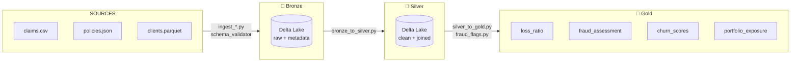

# AXA Claims Lakehouse


---

## Problématique Business

Un grand assureur comme AXA France gère des **millions de contrats, sinistres
et clients** répartis sur des systèmes sources hétérogènes. Ce projet répond
à quatre douleurs business critiques : pilotage du **loss ratio à J+1**,
**détection automatique de la fraude** avant paiement, **anticipation du churn**
client, et **conformité Solvency II + RGPD** via data lineage et data dictionary.

---

## Architecture



→ Voir le [diagramme complet](docs/architecture.md)

---

## Stack Technique

| Composant | Technologie | Version |
|-----------|-------------|---------|
| Langage | Python | 3.11 |
| Framework distribué | PySpark | 3.5.1 |
| Format Lakehouse | Delta Lake | 3.1.0 |
| Qualité données | Great Expectations | 0.18.15 |
| Orchestration cloud | Azure Data Factory | — |
| Orchestration OSS | Apache Airflow | 2.9.1 |
| CI/CD | Azure DevOps Pipelines | — |
| Reporting qualité | Jinja2 | 3.1.x |
| Tests | pytest + coverage | 8.x |

---

## Quick Start

```bash
# 1. Cloner le dépôt
git clone https://github.com/axa-france/axa-claims-lakehouse.git
cd axa-claims-lakehouse

# 2. Installer les dépendances (Python 3.11, Java 11 requis pour Spark)
make install

# 3. Générer les données synthétiques
#    → 50k clients, 80k polices, 120k sinistres, 200k paiements
make generate

# 4. Exécuter le pipeline complet Bronze → Silver → Gold
make run

# 5. (Optionnel) Générer le rapport qualité HTML
make quality

# 6. Lancer les tests
make test
```

**Prérequis :**
- Python 3.11+
- Java 11+ (requis par PySpark)
- ~4 Go RAM libre (Spark local mode)

---

## Business Views — KPIs Gold

### Loss Ratio (`gold/loss_ratio`)

```
loss_ratio = incurred_losses / earned_premium × 100
```

Disponible en **trimestriel**, **YTD** et **rolling 12 mois**,
segmenté par produit × région × canal de vente.

| Seuil | Catégorie |
|-------|-----------|
| < 60 % | Excellent |
| 60–80 % | Bon |
| 80–100 % | Acceptable |
| 100–150 % | Dégradé |
| > 150 % | Critique |

---

### Fraude (`gold/fraud_assessment`)

Moteur de **5 règles PySpark** avec score pondéré :

| Règle | Condition | Poids |
|-------|-----------|-------|
| RULE_001 | Sinistre < 48h après souscription | 25 |
| RULE_002 | Montant > μ + 3σ par produit | 30 |
| RULE_003 | 3+ sinistres / client / 12 mois | 20 |
| RULE_004 | Cluster adresse multi-produits < 30j | 15 |
| RULE_005 | Délai déclaration > 180 jours | 10 |

`fraud_score` ∈ [0, 100]

---

### Churn Score (`gold/churn_scores`)

```python
churn_score = (
    ancienneté_inverse   × 0.30 +
    taux_impayés         × 0.30 +
    taux_refus_sinistres × 0.20 +
    mono_contrat         × 0.20
) × 100
```

Segments : `faible` / `moyen` / `élevé` / `critique`

---

### Portfolio Exposure (`gold/portfolio_exposure`)

- Exposition maximale garantie par région INSEE
- **HHI** (Herfindahl-Hirschman Index) de concentration par produit
- Ratio `sinistres / polices` par région

---

## Data Quality

Le rapport HTML `reports/data_quality_report.html` (généré par `make quality`) contient :
- Taux de nulls par couche et colonne critique
- Contrôle des doublons sur clés naturelles
- Distribution des fraud_scores
- Anomalies détectées (délais négatifs, montants extrêmes, orphelins)

---

## Conformité Réglementaire

### Solvency II

| Exigence | Implémentation |
|----------|---------------|
| Auditabilité des calculs | Delta Lake time travel (`DESCRIBE HISTORY`) |
| Traçabilité des données | `data_lineage.md` + lineage column-level |
| Rétention 10 ans | `VACUUM RETAIN 87600 HOURS` en prod |
| Réconciliation actifs | Test `test_earned_premium_reconciliation` |

### RGPD

| Article | Implémentation |
|---------|---------------|
| Art. 5 — Minimisation | Données personnelles absentes des tables Gold |
| Art. 17 — Droit à l'oubli | `DELETE FROM silver/clients WHERE client_id = ?` (ACID Delta) |
| Art. 25 — Privacy by design | Chiffrement AES-256 au repos, pseudonymisation UUID |
| Art. 30 — Registre traitements | `docs/data_dictionary.md` colonne sensibilité_RGPD |

---

## Structure du Projet

```
axa-claims-lakehouse/
├── data/raw/              # Données brutes générées (claims.csv, policies.json, ...)
├── data/external/         # INSEE + inflation Banque de France
├── src/
│   ├── ingestion/         # Ingestion multi-format → Bronze
│   ├── transformation/    # Bronze→Silver, Silver→Gold, Fraud flags
│   ├── business_views/    # Loss ratio, Churn, Aging, Exposure
│   ├── quality/           # Tests pytest + Great Expectations
│   └── utils/             # SparkSession, Logger, Config
├── orchestration/         # ADF pipeline JSON + Airflow DAG
├── ci_cd/                 # Azure Pipelines + pre-commit
├── monitoring/            # Rapport qualité HTML + métriques pipeline
├── docs/                  # Architecture Mermaid, Data Dictionary, ADR, Lineage
├── generate_data.py       # Générateur données synthétiques (Faker)
├── Makefile               # Commandes make install/generate/run/test/lint/quality/clean
└── requirements.txt
```

---

## Documentation

- [Architecture & Diagramme Mermaid](docs/architecture.md)
- [Data Dictionary (RGPD + SLA)](docs/data_dictionary.md)
- [Data Lineage (Gold → Source)](docs/lineage/data_lineage.md)
- [ADR-001 : Pourquoi Delta Lake](docs/ADR/ADR-001-delta-lake.md)
- [ADR-002 : Pourquoi l'architecture Medallion](docs/ADR/ADR-002-medallion.md)

---

## Contributeurs

| Rôle | Contact |
|------|---------|
| Data Engineering Lead | data-engineering@axa-france.fr |
| Data Ops | data-ops@axa-france.fr |

---

*Projet généré avec Python 3.11 + PySpark 3.5 + Delta Lake 3.1 — AXA France Data Engineering*
