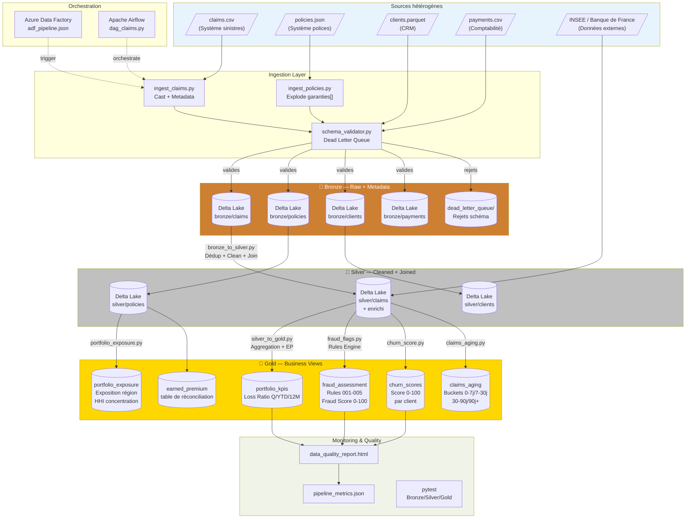

# Architecture AXA Claims Lakehouse

## Vue d'ensemble

Le pipeline implémente une **architecture Medallion** (Bronze / Silver / Gold)
sur Azure Data Lake Storage Gen2, orchestrée par Azure Data Factory et
calculée par Azure Databricks (PySpark 3.5 + Delta Lake 3.x).

---

## Diagramme Mermaid — Pipeline complet

---

## Couches Medallion

| Couche | Format | Partitionnement | Rétention | Usage |
|--------|--------|-----------------|-----------|-------|
| **Bronze** | Delta Lake | année_ingestion / mois_ingestion | 7 ans (Solvency II) | Auditabilité, rejeu |
| **Silver** | Delta Lake | annee_sinistre / mois_sinistre | 5 ans | Analyse, ML |
| **Gold** | Delta Lake | annee / trimestre / produit | 3 ans rolling | Reporting, BI, API |

---

## Flux de données détaillé

### 1. Ingestion → Bronze
- Lecture multi-format (CSV, JSON nested, Parquet)
- Cast des types + normalisation strings
- Validation schéma stricte (`schema_validator.py`)
- Ajout métadonnées : `ingestion_timestamp`, `source_system`, `batch_id`
- Rejet dans `dead_letter_queue/` avec motif

### 2. Bronze → Silver (`bronze_to_silver.py`)
- Déduplication sur clé naturelle (row_number + ingestion_timestamp)
- Nettoyage : trim, lowercase, remplacement nulls métier
- Standardisation dates → `DateType` ISO 8601
- Jointure left (claims ← policies ← clients) avec flag `has_valid_policy`
- Calcul `delai_declaration_jours`
- Partitionnement par `annee_sinistre / mois_sinistre`

### 3. Silver → Gold (`silver_to_gold.py`)
- Calcul `earned_premium` au prorata temporis (période 2021-2024)
- Calcul `incurred_losses` = indemnisés (clos) + provisions (ouvert/en_cours)
- Agrégation 5D : produit × région × canal × année × trimestre
- Métriques window : YTD, rolling 12 mois
- Optimisation lecture : Z-order, auto-compact

### 4. Fraud Detection (`fraud_flags.py`)
Cinq règles métier avec score pondéré :

| Règle | Condition | Poids |
|-------|-----------|-------|
| RULE_001 | Sinistre < 48h après souscription | 25 pts |
| RULE_002 | Montant > mean + 3σ produit | 30 pts |
| RULE_003 | 3+ sinistres / client / 12 mois | 20 pts |
| RULE_004 | Même adresse, produits différents, < 30j | 15 pts |
| RULE_005 | Délai déclaration > 180 jours | 10 pts |

`fraud_score = Σ(poids × flag)` → borné [0, 100]

---

## Stack Technique

| Composant | Technologie | Version |
|-----------|-------------|---------|
| Langage | Python | 3.11 |
| Framework distributed | PySpark | 3.5.1 |
| Format lakehouse | Delta Lake | 3.1.0 |
| Qualité données | Great Expectations | 0.18.15 |
| Orchestration | Apache Airflow | 2.9.1 |
| Orchestration cloud | Azure Data Factory | — |
| CI/CD | Azure DevOps Pipelines | — |
| Stockage | Azure Data Lake Gen2 (local: filesystem) | — |
| Monitoring | Jinja2 HTML Reports | 3.1.x |

---

## Décisions d'architecture

- [ADR-001 : Delta Lake vs Parquet vs Iceberg](ADR/ADR-001-delta-lake.md)
- [ADR-002 : Architecture Medallion vs Data Vault vs ODS](ADR/ADR-002-medallion.md)
